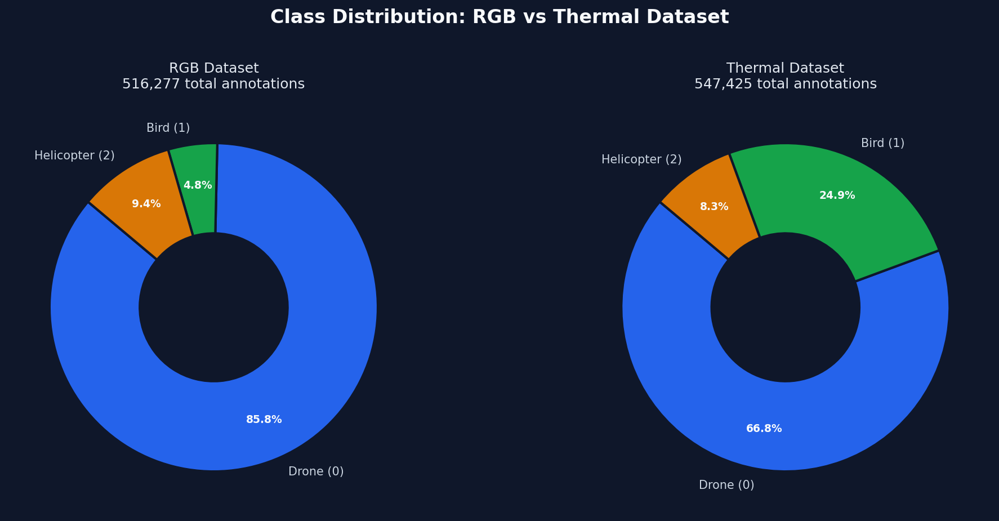
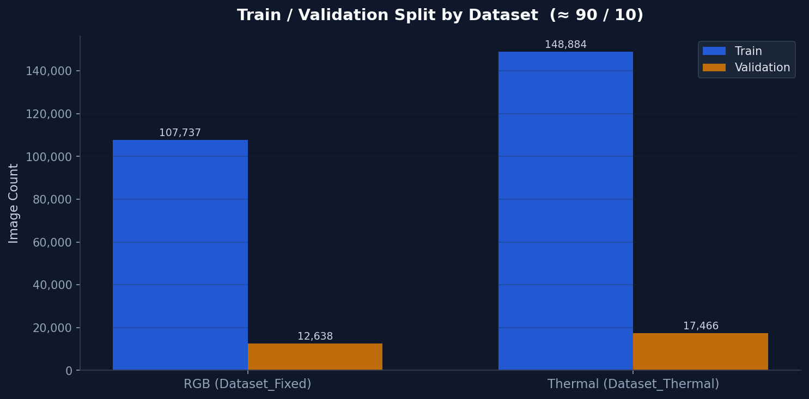
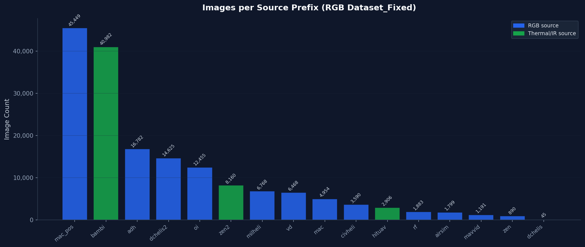
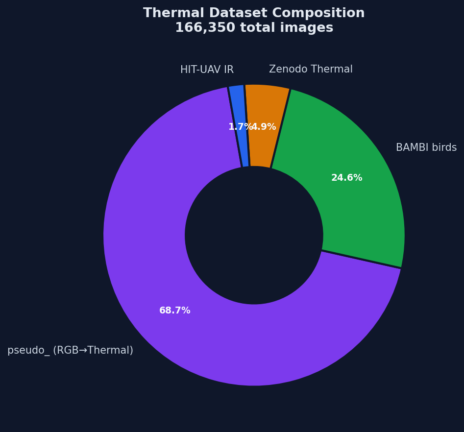
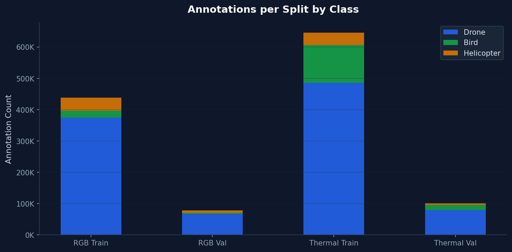

# Honeywell Drone Interceptor — DP5 Detection Dataset

> Multi-class aerial object detection for autonomous drone interception systems.  
> Built for the Honeywell DP5 project.

---

## What This Dataset Is

Detecting a drone in the wild is hard. It shares the sky with birds and helicopters, it can be tiny, fast-moving, and thermally indistinct from background clutter. This dataset was built specifically to solve that problem.

It aggregates over **286,000 images** from 14 public and synthetic sources, re-annotated and unified under a single three-class schema:

| ID | Class | Description |
|---|---|---|
| `0` | **drone** | Multi-rotor UAVs, fixed-wing UAVs, micro drones |
| `1` | **bird** | All bird species in flight — the most common false positive |
| `2` | **helicopter** | Civil, military, and specialist rotorcraft |

Every image has been verified: zero coordinate violations, no duplicate frames, no corrupted files, sequence-aware train/val splits to prevent temporal leakage.

The dataset comes in two modalities — **RGB** for standard daylight detection and **pseudo-thermal** for infrared simulation — so a model can be trained on either or both.

---

## Numbers

| | RGB Dataset | Thermal Dataset |
|---|---|---|
| Train images | 107,737 | 148,884 |
| Val images | 12,638 | 17,466 |
| **Total images** | **120,375** | **166,350** |
| Total annotations | 516,277 | 547,425 |
| Val split | 10.5% | 10.5% |
| Preflight status | **GO** | **GO** |

**Grand total: 286,725 images · 1,063,701 annotations**

---

## Class Distribution



The RGB dataset is drone-heavy by design — the interceptor's primary target. The thermal dataset has stronger bird representation thanks to the BAMBI bird corpus (40,982 dedicated bird images), making the thermal model more robust against the most common false positive in aerial surveillance.

---

## Train / Validation Split



Splits are **sequence-aware**: no two frames from the same video clip appear in both train and val. This prevents the model from memorising sequences rather than learning to detect. Pseudo-thermal images are locked to the train set — they are derived from RGB frames, so allowing them into val would create a data-leakage path.

---

## Where the Images Come From



| Source | Images | Classes |
|---|---|---|
| Maciullo drone sequences | 50,403 | drone |
| ADH Roboflow | 16,782 | drone, helicopter |
| Helicopters-of-DC | 14,670 | helicopter |
| BAMBI bird corpus | 40,982 | bird |
| OpenImages v7 | 12,455 | bird, helicopter |
| Military Helicopter Dataset | 6,768 | helicopter |
| VisDrone | 6,468 | drone |
| Zenodo Thermal (real IR) | 8,160 | drone |
| Civil Helicopter | 3,590 | helicopter |
| HIT-UAV infrared | 2,906 | drone, background |
| Roboflow Delivery | 1,883 | helicopter |
| AirSim synthetic | 1,799 | drone |
| MAV-VID | 1,191 | drone |
| Zenodo UAV | 890 | drone |

---

## Thermal Dataset Composition



The thermal modality was built by layering four sources:

- **Pseudo-thermal (114,302 images)** — every RGB training image passed through an OpenCV INFERNO colormap to simulate the visual signature of an infrared camera
- **BAMBI birds (40,982 images)** — real bird flight footage, forced to class 1
- **Zenodo Thermal (8,160 images)** — real drone thermal imagery
- **HIT-UAV IR (2,906 images)** — real infrared surveillance footage used as background negatives

---

## Annotations by Split



---

## Dataset Folder

```
dataset/
├── DATASET_CARD.md          ← machine-readable summary with all counts
└── configs/
    ├── dataset_train.yaml       ← RGB training
    ├── dataset_thermal.yaml     ← Thermal training
    ├── dataset_combined.yaml    ← RGB + Thermal combined
    └── dataset_dota_test.yaml   ← Zero-shot evaluation on DOTA v1.0
```

All YAML configs use relative paths and work on Windows, Linux, and macOS without modification.

---

## Using the Dataset

```bash
# RGB baseline
yolo train model=yolov10n.pt data=dataset/configs/dataset_train.yaml \
     imgsz=640 epochs=100 batch=32

# Thermal model
yolo train model=yolov10n.pt data=dataset/configs/dataset_thermal.yaml \
     imgsz=640 epochs=100 batch=32

# Combined modality
yolo train model=yolov10n.pt data=dataset/configs/dataset_combined.yaml \
     imgsz=640 epochs=150 batch=32

# Zero-shot generalisation test
yolo val model=best.pt data=dataset/configs/dataset_dota_test.yaml
```

The image data (31 GB) is not stored in this repository. Place `Dataset_Fixed/` and `Dataset_Thermal/` in the same directory as the `dataset/` folder so the config relative paths resolve:

```
project_root/
├── Dataset_Fixed/          ← 120,375 RGB images
├── Dataset_Thermal/        ← 166,350 thermal images
└── dataset/                ← this repo
```

---

## Verification

Both datasets pass the full preflight gate:
- All 286,725 image–label pairs matched
- **Zero** coordinate violations across 1,063,701 annotations
- No invalid class IDs
- No duplicate frames
- Sequence-aware splits — no temporal leakage

---

## Sources and Acknowledgements

This dataset aggregates and re-annotates imagery from publicly available research datasets:

[VisDrone](http://aiskyeye.com/) · [UAVDT](https://sites.google.com/view/grli-uavdt) · [MAV-VID](https://bitbucket.org/ViXeR/mav-vid) · [HIT-UAV](https://github.com/fanq15/HIT-UAV-Infrared-Thermal-Dataset) · [BAMBI](https://zenodo.org/record/7842216) · [Zenodo Thermal](https://zenodo.org/record/6349800) · [OpenImages v7](https://storage.googleapis.com/openimages/web/index.html) · [Roboflow Universe](https://universe.roboflow.com/) · [AirSim](https://github.com/microsoft/AirSim)

> Assembled for research use within the Honeywell Drone Interceptor project. Respect the individual licences of each upstream source when redistributing.
